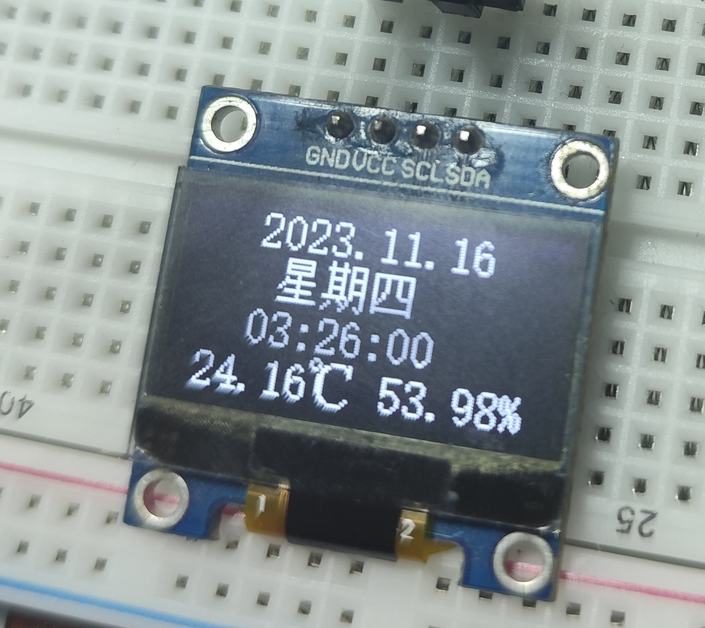
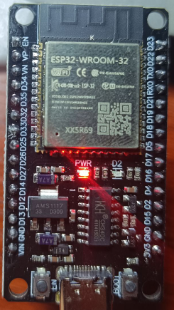
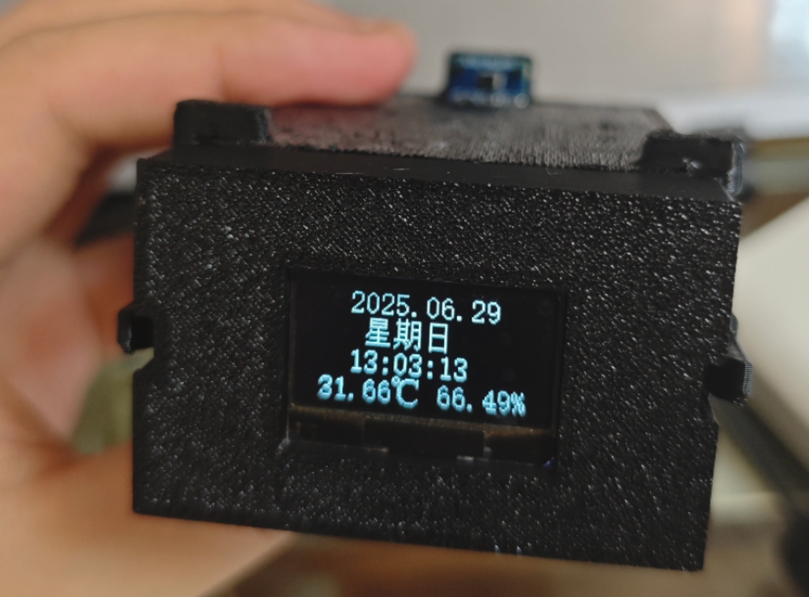
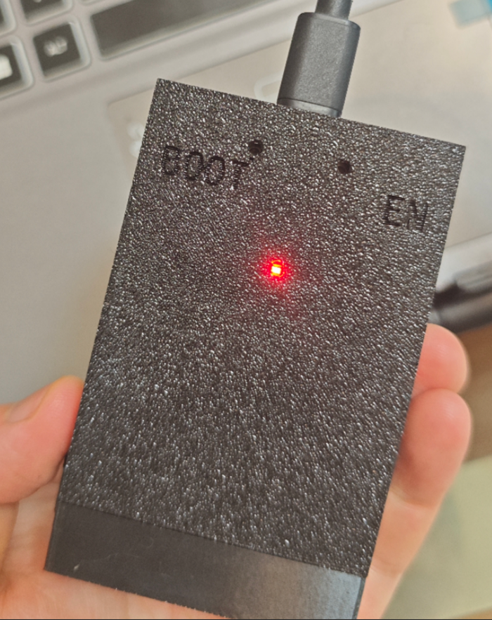
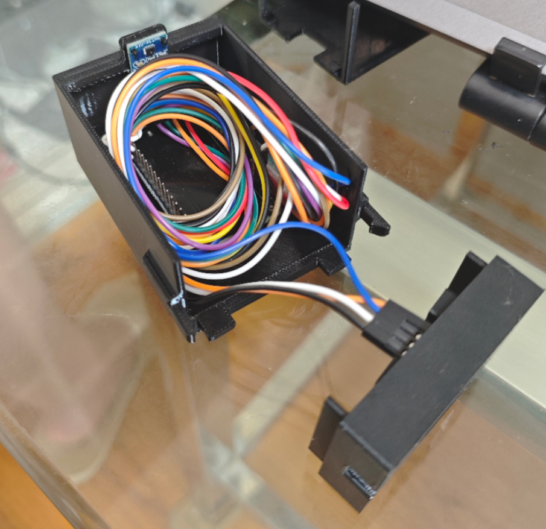

# tempo

20231116  
一个支持联网对时，显示时间和温湿度的小玩意。刚学 ESP32，探索性做的，目前还不知道有什么问题，连续运行测试中。

  
  
基本逻辑就是通电后，连接设定好的 WiFi，然后同步时间，同步完成后关闭 WiFi，之后就是循环每秒刷新一次 OLED 显示内容，最下面一行是温度和湿度。另外对于周期性时间同步，只是简单实现，每天到 00:00:00 就重启 ESP32，然后就会从头走一遍。

---

20250629  
最近我买了台 3D 打印机，自己画了一个外壳，用 Solidworks 2024 SP5 画的，原文件在目录[外壳模型/Solidworks模型](外壳模型/Solidworks模型)，STEP 文件在[外壳模型/温湿度计外壳.STEP](外壳模型/温湿度计外壳.STEP)。  
  
  
  

# 环境

## 硬件

ESP32-WROOM-32  
128x64 IIC OLED  
SHT30 温湿度计  

## 软件

Arduino IDE 2.2.1  
Adafruit_SSD1306 2.5.7  
Adafruit_SHT31 2.2.2  
Adafruit_BusIO 1.14.5  
Adafruit-GFX-Library 1.11.9

# 引脚接线

SHT30 和 OLED 都是使用 IIC 通信，两者的 SDA 和 SCL 可以各自接到一起，然后插到 ESP32 引脚上。  
* SDA - 21
* SCL - 22  